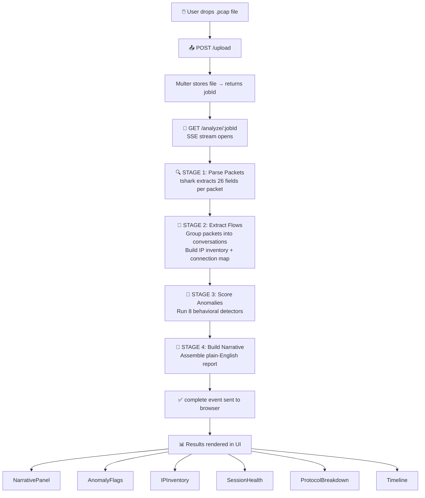

# 🦈 PCAP Storyteller

> **Upload a packet capture. Get a plain-English story of your network.**

[](https://pcap-storyteller.vercel.app/)
[](https://pcap-storyteller-8vui.onrender.com/health)
[](https://pcap-storyteller.vercel.app/)

---

## 🌟 What is PCAP Storyteller?

PCAP Storyteller is a **full-stack network traffic analysis tool** that transforms raw `.pcap` / `.pcapng` / `.cap` packet captures into clear, human-readable reports — no Wireshark expertise required.

Drop in a capture file → the pipeline parses every packet, extracts flows, scores anomalies, and narrates back exactly what happened on your network, including **security threats**, **TCP health**, **protocol breakdowns**, and **Wireshark filter recommendations** — all in seconds.

---

## ✨ Features at a Glance

| Feature | Description |
|---|---|
| 📂 **Drag & Drop Upload** | Drop a `.pcap`, `.pcapng`, or `.cap` file (up to 100 MB) |
| 📡 **Live Streaming Pipeline** | Watch each analysis stage complete in real time via SSE |
| 📖 **Plain-English Narrative** | Auto-generated multi-paragraph report covering the entire capture |
| 🚨 **8 Anomaly Detectors** | Port scans, SYN floods, exfiltration, DNS tunneling, and more |
| 🌐 **IP Inventory** | Role-classified table of every host (client / server / gateway) |
| 💓 **Session Health Panel** | TCP state breakdown — established, half-open, RST, graceful-close |
| 📊 **Protocol Breakdown** | Volume and packet-count by protocol |
| ⏱️ **Flow Timeline** | Visual timeline of every conversation in the capture |
| 🖥️ **Resizable Panels** | Drag panel borders on desktop to customize your workspace |
| 📱 **Mobile Responsive** | Full tab-based UI on phones and tablets |

---

## 🔴 Live Demo

**👉 [https://pcap-storyteller.vercel.app/](https://pcap-storyteller.vercel.app/)**

No sign-up. No API key. Just drop a capture file and go.

---

## 🏗️ Architecture

```
┌─────────────────────────────────────────────────────────────────┐
│                        USER BROWSER                             │
│                                                                 │
│   ┌─────────────┐     drag & drop      ┌──────────────────┐    │
│   │  Drop Zone  │ ──── .pcap file ───▶ │  React Frontend  │    │
│   └─────────────┘                      │  (Vercel)        │    │
│                                        └────────┬─────────┘    │
└─────────────────────────────────────────────────┼───────────────┘
                                                  │
                                    POST /upload  │  GET /analyze/:jobId
                                                  │  (Server-Sent Events)
                                                  ▼
┌─────────────────────────────────────────────────────────────────┐
│                    NODE.JS BACKEND (Render)                     │
│                                                                 │
│   ┌──────────┐   ┌──────────┐   ┌───────────┐   ┌──────────┐  │
│   │  parser  │──▶│  flows   │──▶│ anomalies │──▶│ narrator │  │
│   │ (tshark) │   │ extractor│   │  scorer   │   │ builder  │  │
│   └──────────┘   └──────────┘   └───────────┘   └──────────┘  │
│        │               │               │               │        │
│   26 fields       flow map +      8 detectors     structured   │
│   per packet      IP inventory    severity 1-10   paragraphs   │
│                                                                 │
└─────────────────────────────────────────────────────────────────┘
```

---

## 🔄 Analysis Pipeline



---

## 🚨 Anomaly Detectors

PCAP Storyteller runs **8 independent behavioral detectors** on every capture, each scoring findings from **1 (low) to 10 (critical)**:

### 🔍 1. Port Scan Detection
Flags any source IP that contacts **15+ distinct destination ports**. Distinguishes between full-connect scans and stealth SYN-only scans (higher severity).

> `192.168.1.5 contacted 127 distinct ports across 1 host — SYN-only, no data exchange observed` **(severity 9)**

---

### 💣 2. SYN Flood Detection
Catches **unanswered SYN storms** targeting a single destination — classic DoS/DDoS indicator. Detects both single-source and distributed variants.

> `10.0.0.1: 1,240 unanswered SYN packets from 6 sources (multiple sources) — no SYN-ACK returned` **(severity 9)**

---

### 📤 3. Data Exfiltration
Spots internal hosts sending **large volumes outbound** with a lopsided outbound/inbound ratio (≥5:1, ≥1 MB). Classic data theft signature.

> `192.168.1.20 transferred 45.3 MB to external host 203.0.113.9 — 89:1 outbound/inbound ratio` **(severity 7)**

---

### 🕳️ 4. DNS Tunneling
Identifies **long subdomain labels**, **high-entropy query names**, **oversized responses**, and **high query frequency** — the hallmarks of C2-over-DNS or data exfiltration via DNS.

> `192.168.1.15: 312 DNS queries, avg 58-char labels, 87 extended-name queries, 24 high-entropy names` **(severity 9)**

---

### 🔓 5. Cleartext Credentials
Flags sessions over **FTP (21), Telnet (23), SMTP (25), HTTP (80), POP3 (110), IMAP (143)** — protocols that carry credentials in the clear.

> `Telnet session from 192.168.1.3 to 10.0.0.5:23 — full session including credentials in plaintext` **(severity 9)**

---

### 📡 6. Beaconing
Detects **machine-like periodic outbound connections** to external hosts using coefficient of variation (CV ≤ 0.3). Low CV = highly regular = likely malware C2 heartbeat.

> `192.168.1.10 → 198.51.100.5:443: 48 connections at ~60s avg interval (±3s, CV 0.050)` **(severity 8)**

---

### 🔁 7. High Retransmission Rate
Identifies individual TCP flows with **≥15% retransmission rates** — indicating path congestion, lossy links, or receive-buffer exhaustion.

> `192.168.1.2 → 10.0.0.1:8080 (HTTP-alt) — 31.4% retransmission rate (89/283 packets)` **(severity 6)**

---

### 🩺 8. Session Issues
Three sub-detectors in one:
- **Half-open sessions** — SYN sent, no SYN-ACK (unreachable hosts or stealth scans)
- **RST storms** — mass TCP reset activity (firewall rejection, idle timeout, app errors)
- **Zero-window stalls** — receiver buffer exhaustion causing transfer freezes

> `23 half-open TCP sessions to 10.0.0.50 from 2 sources` **(severity 5)**

---

## 🛠️ Tech Stack

### Frontend
| Technology | Purpose |
|---|---|
| ⚛️ **React 18** | Component-based UI |
| ⚡ **Vite** | Build tool & dev server |
| 🎨 **Tailwind CSS** | Utility-first styling |
| 🔌 **SSE (fetch + ReadableStream)** | Real-time streaming from backend |

### Backend
| Technology | Purpose |
|---|---|
| 🟢 **Node.js (ESM)** | Runtime |
| 🚂 **Express** | HTTP server |
| 🦈 **tshark (Wireshark CLI)** | Packet dissection — extracts 26 fields per packet |
| 📦 **Multer** | File upload handling |
| 🔄 **Server-Sent Events** | Streaming analysis progress to the browser |

### Infrastructure
| Service | Role |
|---|---|
| ▲ **Vercel** | Frontend hosting (auto-deploy from `main`) |
| 🎯 **Render** | Backend hosting |
| ⏰ **Cron Job** | Keep-alive ping every 14 min to prevent Render cold starts |

---

## 📸 UI Overview

```
┌─────────────────────────────────────────────────────────┐
│  ● PCAP Storyteller          capture.pcap  47 KB  [New] │  ← Header
├──────────┬──────────────────────────────────────────────┤
│ Pipeline │  📖 Analysis Narrative          🚨 Anomalies │
│          │  ─────────────────────────────  ──────────── │
│ ✅ Upload│  Capture window: 12:00 – 12:45  [9] Port scan│
│ ✅ Parse │  1,204 packets across 87 flows  [8] Beaconing│
│ ✅ Flows │  Total volume: 4.2 MB           [7] FTP creds│
│ ✅ Score │  Retransmission rate: 2.1%      ...          │
│ ✅ Story │                                              │
│          ├──────────────┬───────────────┬──────────────┤
│          │ 🌐 IPs       │ 💓 Health     │ 📊 Protocols │
│          │ 192.168.1.1  │ Established 12│ TCP   61%    │
│          │ 10.0.0.5     │ Half-open   3 │ UDP   22%    │
│          │ 203.0.113.9  │ RST         1 │ DNS    9%    │
│          ├──────────────┴───────────────┴──────────────┤
│          │  ⏱️ Flow Timeline                            │
└──────────┴──────────────────────────────────────────────┘
```

---

## 🚀 Running Locally

### Prerequisites
- **Node.js** ≥ 18
- **Wireshark / tshark** installed and in `PATH`
  - Windows: [wireshark.org/download](https://www.wireshark.org/download.html)
  - macOS: `brew install wireshark`
  - Linux: `sudo apt install tshark`

### 1. Clone the repo
```bash
git clone https://github.com/Vishnu200399/pcap-storyteller.git
cd pcap-storyteller
```

### 2. Install dependencies
```bash
cd backend && npm install
cd ../frontend && npm install
```

### 3. Start both servers

**Windows (PowerShell):**
```powershell
.\start.ps1
```

**Manual (two terminals):**
```bash
# Terminal 1 — Backend
cd backend
npm run dev       # starts on http://localhost:3001

# Terminal 2 — Frontend
cd frontend
npx vite          # starts on http://localhost:5173
```

### 4. Open the app
Visit **[http://localhost:5173](http://localhost:5173)** and drop in a `.pcap` file.

---

## ⚙️ Environment Variables

### Backend (Render / `.env`)
| Variable | Default | Description |
|---|---|---|
| `FRONTEND_URL` | `http://localhost:5173` | Allowed CORS origin |
| `PORT` | `3001` | Server port |
| `TSHARK_PATH` | `tshark` | Full path to tshark binary if not in PATH |

### Frontend (Vercel / `.env.local`)
| Variable | Default | Description |
|---|---|---|
| `VITE_API_URL` | `/api` (proxied locally) | Backend base URL |

---

## 📁 Project Structure

```
pcap-storyteller/
├── backend/
│   ├── src/
│   │   ├── index.js       # Express server, upload + SSE endpoints
│   │   ├── parser.js      # tshark wrapper — extracts 26 fields/packet
│   │   ├── flows.js       # Flow extraction, IP inventory, connection map
│   │   ├── anomalies.js   # 8 behavioral anomaly detectors
│   │   └── narrator.js    # Plain-English report generator
│   ├── Dockerfile
│   └── package.json
│
├── frontend/
│   ├── src/
│   │   ├── App.jsx                      # Root layout (desktop + mobile)
│   │   ├── hooks/
│   │   │   ├── useAnalysis.js           # Upload + SSE streaming state
│   │   │   └── useResize.js             # Draggable panel logic
│   │   └── components/
│   │       ├── DropZone.jsx             # File picker / drag-and-drop
│   │       ├── PipelineProgress.jsx     # Stage tracker
│   │       ├── NarrativePanel.jsx       # Streaming text report
│   │       ├── AnomalyFlags.jsx         # Severity-sorted anomaly list
│   │       ├── IPInventory.jsx          # Host table with roles
│   │       ├── SessionHealth.jsx        # TCP session stats
│   │       ├── ProtocolBreakdown.jsx    # Protocol distribution
│   │       ├── Timeline.jsx             # Flow timeline
│   │       └── ResizeHandle.jsx         # Panel resize drag handle
│   └── package.json
│
├── start.ps1              # One-command local launcher (Windows)
└── README.md
```

---

## 🔒 Security Notes

- Uploaded files are stored server-side only for the duration of the analysis session (in-memory job store — no database)
- File type validation enforced on both client and server (`.pcap`, `.pcapng`, `.cap` only)
- 100 MB upload limit enforced via Multer
- CORS restricted to the configured frontend origin only

---

## 🗺️ Roadmap Ideas

- [ ] 🗺️ Geo-IP map of external hosts
- [ ] 🤖 LLM-powered narrative (GPT / Claude) for richer explanations
- [ ] 📤 Export report as PDF or Markdown
- [ ] 🔍 Clickable flows that open Wireshark filter with one tap
- [ ] 🐳 Docker Compose for one-command local setup
- [ ] 📂 Support for multiple simultaneous uploads

---

## 👤 Author

**Vishnu** — [@Vishnu200399](https://github.com/Vishnu200399)

---

## 📄 License

MIT — do whatever you want with it. If you build something cool on top, a ⭐ is always appreciated!

---

<div align="center">

**Built with 🦈 tshark + ⚛️ React + 🚂 Express**

[🚀 Try it live →](https://pcap-storyteller.vercel.app/)

</div>
